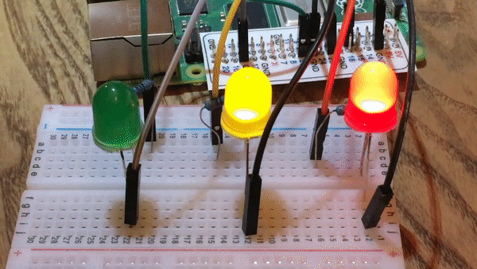

## Introduction

Learn how to use the GPIO pins on your Raspberry Pi to interface with electronic components, such as LEDs and PIRs.

### What you will make

--- no-print ---

--- /no-print ---

--- print-only ---

--- /print-only ---

--- collapse ---
---
title: What you will need
---
## What you will need

### Hardware

As well as a Raspberry Pi with an SD card and the usual peripherals, you'll also need:

|1x Solderless breadboard | Male-to-female jumper leads | Female-to-female jumper leads | Male-to-male jumper leads |
|:--------:|:-------:|:--------:|:--------:|
|  |  |  |  |

| 1x Tactile button | 3x LEDs | Ultrasonic distance sensor| Passive infrared motion sensor |
|:--------:|:-------:|:--------:|:--------:|
|  |  |  |  |

| Light Dependent Resistor | 5V Motor | 3x 330Ω Resistor| 470Ω Resistor |
|:--------:|:-------:|:--------:|:--------:|
|  |  |  |  |

| 1x 1μF Capacitor | Buzzer | Motor Controller | Battery Pack |
|:--------:|:-------:|:--------:|:--------:|
|  |  |  |  |

### Software

There are no additional software requirements for this resource beyond what is pre-installed in the current Raspbian image.

--- /collapse ---

--- collapse ---
---
title: What you will learn
---

+ Know how wire a variety of components to the Raspberry Pi
+ Know how to interact with a variety of components using Python

--- /collapse ---

--- collapse ---
---
title: Additional information for educators
---

If you need to print this project, please use the [printer-friendly version](https://projects.raspberrypi.org/en/projects/physical-computing/print){:target="_blank"}.

You can [find the solution for this project here](http://rpf.io/p/en/physical-computing-get){:target="_blank"}.

--- /collapse ---

