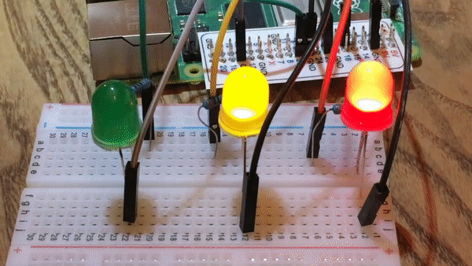
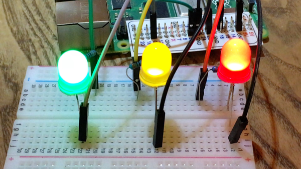
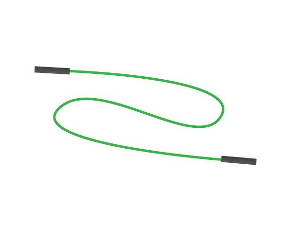
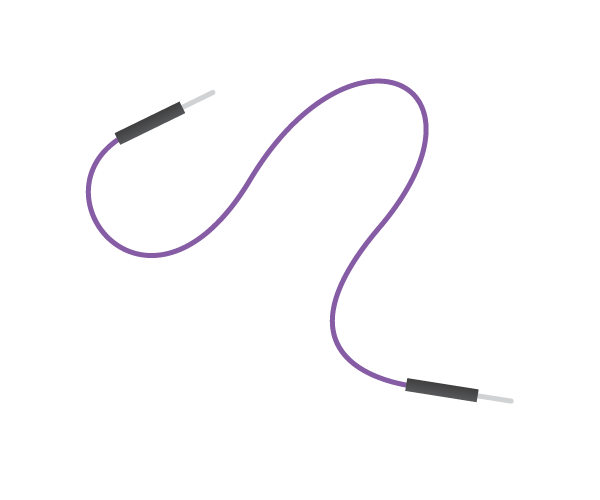
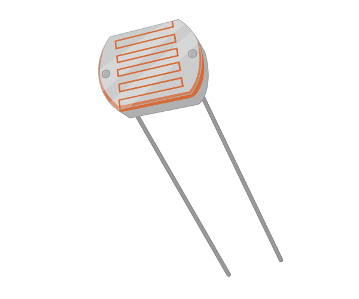
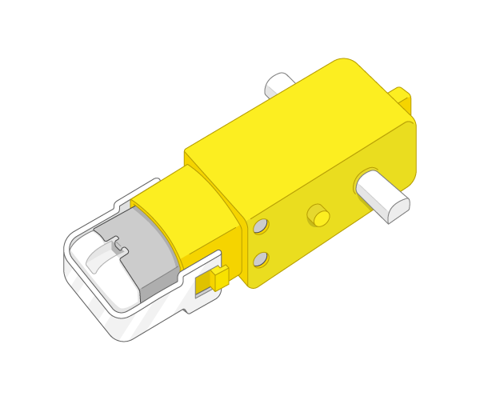
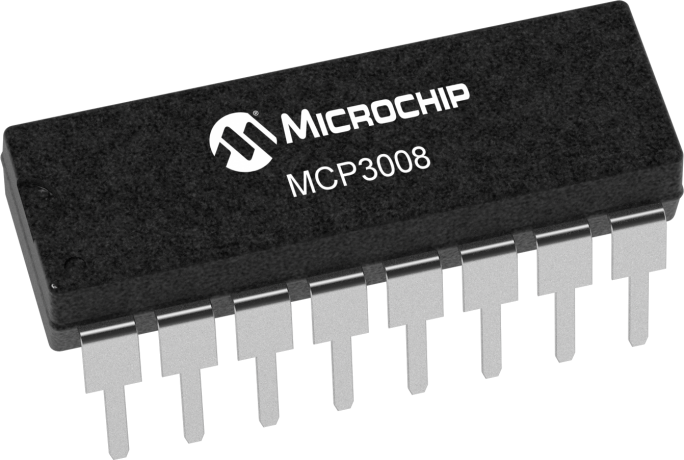
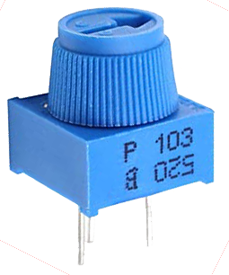

## Introduction

Apprendre à utiliser les ports GPIO de votre Raspberry Pi pour s'interfacer avec des composants électronique, comme des LEDs et des PIRs.

### Ce que vous allez faire

--- no-print ---

--- /no-print ---

--- print-only ---

--- /print-only ---

--- collapse ---
---
title: Ce dont vous aurez besoin
---
## Ce dont vous aurez besoin

### Matériel

En plus d'un Raspberry Pi avec un carte SD et les périphériques habituels, vous aurez aussi besoin:

|1x Solderless breadboard | Male-to-female jumper leads | Female-to-female jumper leads | Male-to-male jumper leads |
|:--------:|:-------:|:--------:|:--------:|
|  |  |  |  |

| 1x Bouton tactile | 3x LEDs | Ultrasonic distance sensor| Passive infrared motion sensor |
|:--------:|:-------:|:--------:|:--------:|
|  |  |  |  |

| Light Dependent Resistor | Moteur 5V | 3x Résistance 330Ω | 1x Résistance 470Ω |
|:--------:|:-------:|:--------:|:--------:|
|  |  |  |  |

| 1x Capaciteur 1μF | 1x Buzzer | 1x Contrôleur de Moteur |
|:--------:|:-------:|:--------:|
|  |  |  |

| Battery Pack | 1x MCP3008 ADC | Potentiomètre |
|:--------:|:--------:|:-------:|
|  |  |  |

### Logiciels

Il n'y a pas de logiciels additionnels requis pour cette ressource en plus de ce qui est pré-installé sur l'image courante de Raspbian. 

--- /collapse ---

--- collapse ---
---
title: Ce que vous allez apprendre
---

+ Apprendre comment câbler une variété de composants à un Raspberry Pi
+ Apprendre comment intéragir avec une variété de composants à l'aide de Python

--- /collapse ---

--- collapse ---
---
title: Additional information for educators
---

Si vous avez besoin d'imprimer ce projet, utilisez la [version compatible impression](https://projects.raspberrypi.org/fr/projects/physical-computing/print){:target="_blank"}. 

You can [trouver la solution pour ce projet ici](http://rpf.io/p/en/physical-computing-get){:target="_blank"}.

--- /collapse ---

